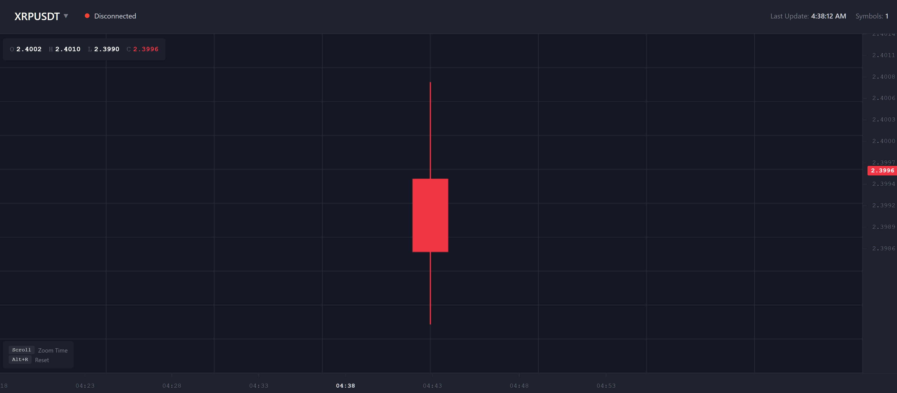
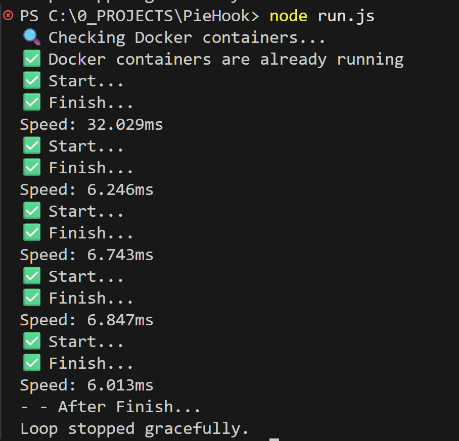

<h1 align="center">🧩 PieHook</h1>

<p align="center">
  <!-- GitHub badges -->
  <a href="https://github.com/israice/PieHook/stargazers">
    
  </a>
  <a href="https://github.com/israice/PieHook/forks">
    
  </a>
  
  
</p>


## 🚀 Live Website

> **Try it instantly:**  
> https://piehook.weforks.org/

<!-- ---------------------------------------------------------- -->

<details>

  <summary>Dev</summary>

### Last Dev Update

- v0.0.7 - added SSE method for web page live updates from csv file

<div align="center">


</div>


### Before start
npm install ws redis yaml rxjs node-fetch js-yaml

## stop server
```Bash
docker compose -f docker-compose.dev.yml down
docker compose -f docker-compose.prod.yml down

docker compose -f docker-compose.prod.yml logs backend

```

## start or update server
```Bash
docker compose -f docker-compose.dev.yml up --build -d
docker compose -f docker-compose.prod.yml up --build -d
```

### Run the checks
```Bash
node run.js
```

---

### Dev Roadmap
- [x] v0.0.1 - created docker with Redis for candle data based 
- [x] v0.0.2 - created js websocket to save in Rediswebsocket 
- [x] v0.0.3 - created A_get_candle[0]_from_redis
- [x] v0.0.4 - created A_clone_candle[0]
- [x] v0.0.5 - created main runner and backend runner
- [x] v0.0.6 - created A_pre_start B_reset C_after_finish
- [x] v0.0.7 - created screenshot.png
  - fxed redis websocket and A_get_candle[0]_from_redis
  - added SSE method for web page live updates from csv file
  - added tradingview style to froendend page 
  - added docker-compose.prod.yml
  - added AUTOUPDATE_WEBHOOK_FROM_GITHUB
- [x] v0.0.8 - added version
- [ ] v0.0.9 - get all other candles [0] and save in history file
- [ ] v0.0.10 - check for each timeframe percent and trend 


## update repository

```Bash
git add .
git commit -m "v0.0.9 - test 1 version"
git push
```

```Powershell
git log --oneline -n 10
```

```Powershell
Copy-Item .env $env:TEMP\.env.backup
git reset --hard de8b98f
git clean -fd
Copy-Item $env:TEMP\.env.backup .env -Force
git push origin master --force  
```


</details>