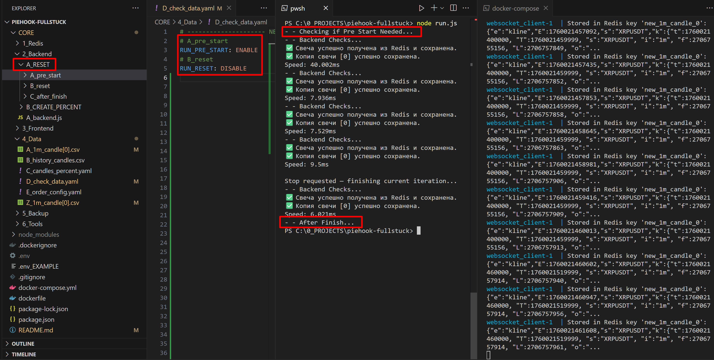

## PieHook-JS




### Before start
npm install ws redis yaml rxjs node-fetch js-yaml

### Run Redis Docker
docker-compose up -d --build

### Show Websocket in Dcoker
docker-compose logs -f websocket_client

### Run the checks
node run.js

---

### Dev Roadmap
- [x] v0.0.1 - created docker with Redis for candle data based 
- [x] v0.0.2 - created js websocket to save in Rediswebsocket 
- [x] v0.0.3 - created A_get_candle[0]_from_redis
- [x] v0.0.4 - created A_clone_candle[0]
- [x] v0.0.5 - created main runner and backend runner
- [x] v0.0.6 - created A_pre_start B_reset C_after_finish
- [x] v0.0.7 - created screenshot.png
    - fxed redis websocket and A_get_candle[0]_from_redis
- [ ] v0.0.8 - get all other candles [0] and save in history file
- [ ] v0.0.9 - check for each timeframe percent and trend 


  ## update repository

  ```Bash
  git add .
  git commit -m "v0.0.7 - fxed redis websocket and A_get_candle[0]_from_redis"
  git push
  ```

  
  ```Powershell
  git log --oneline -n 10
  ```
  ```Powershell
  Copy-Item .env $env:TEMP\.env.backup
  git reset --hard de8b98f
  git clean -fd
  Copy-Item $env:TEMP\.env.backup .env -Force
  git push origin master --force  
  ```